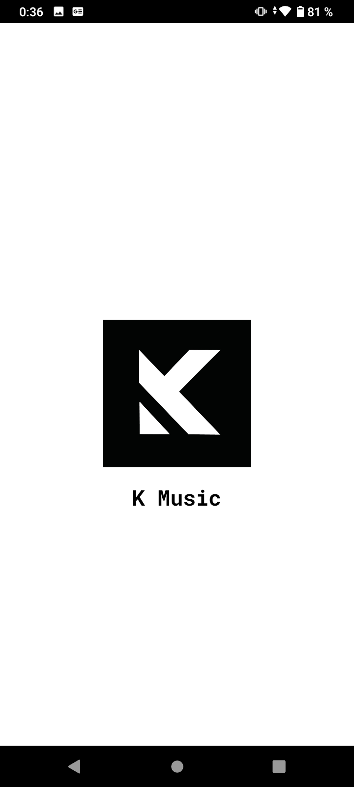
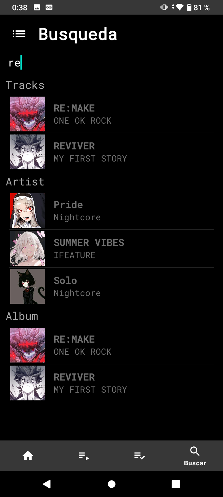
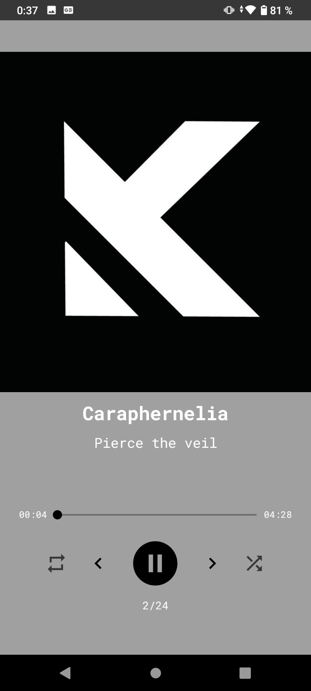

#  Reproductor de Música
Este proyecto es un reproductor de música creado con Android Studio. La aplicación permite a los usuarios reproducir sus canciones favoritas con una interfaz intuitiva y fácil de usar. A continuación, se muestran capturas de la aplicación en ejecución.

#  Descripción del Proyecto
El reproductor de música incluye las siguientes características:

#  Interfaz de usuario amigable: Diseño limpio y navegación sencilla.
-Gestión de listas de reproducción: Crea y administra tus listas de reproducción personalizadas.
-Controles de reproducción: Reproducir, pausar, avanzar y retroceder canciones.
-Visualización de metadatos: Muestra información sobre la canción que se está reproduciendo, como el título, el artista y la portada del álbum.
-Busqueda de Cancion: Mostra la lista de la cancion a buscar.

#  Capturas de Pantalla
A continuación, se muestran algunas capturas de pantalla de la aplicación en funcionamiento:

# Reproductor de Música

Este proyecto es un reproductor de música creado con Android Studio. La aplicación permite a los usuarios reproducir sus canciones favoritas con una interfaz intuitiva y fácil de usar. A continuación, se muestran capturas de la aplicación en ejecución.

## Capturas de Pantalla

<table>
  <tr>
     <td style="text-align: center; display: flex; justify-content: center;">
      
      
Pantalla de Inicio (Carga) 

    </td>
    <td style="text-align: center; display: flex; justify-content: center;">
      
      
Lista por Artistas

    </td>
    <td style="text-align: center; display: flex; justify-content: center;">
      
      
Reproducción de Canción

    </td>
  </tr>
  <tr>
    <td style="text-align: center; display: flex; justify-content: center;">
      
      
Busqueda

    </td>
    <td style="text-align: center; display: flex; justify-content: center;">
      
      
Imagen por Default

    </td>
    <td style="text-align: center; display: flex; justify-content: center;">
        
        
Lista de Reproducción

      </td>
    </tr>
</table>
